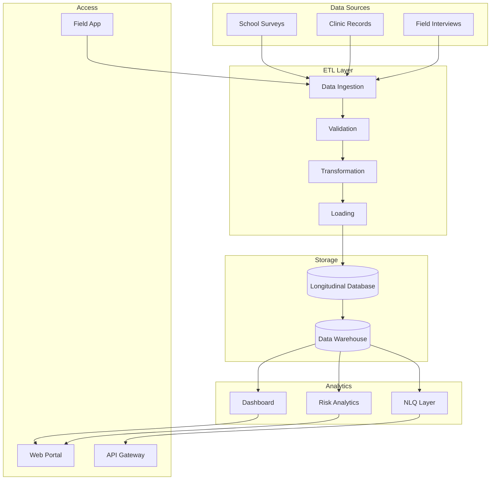

# Architecture Overview

## System Context

NEPS WP4 is a multi-country digital platform for longitudinal youth psychosocial monitoring. It serves multiple countries, each with its own data collection sites and research teams.

## Component Architecture

## Key Design Decisions

| Decision | Rationale | ADR |
|----------|-----------|-----|
| Centralised database per country | Data sovereignty requirements | ADR-0002 |
| LangChain for NLQ | Rapid prototyping, Python ecosystem | ADR-0003 |
| Dashboard per country site | Performance isolation | ADR-0004 |

See the [ADRs](../../adr/) for detailed decision records.
